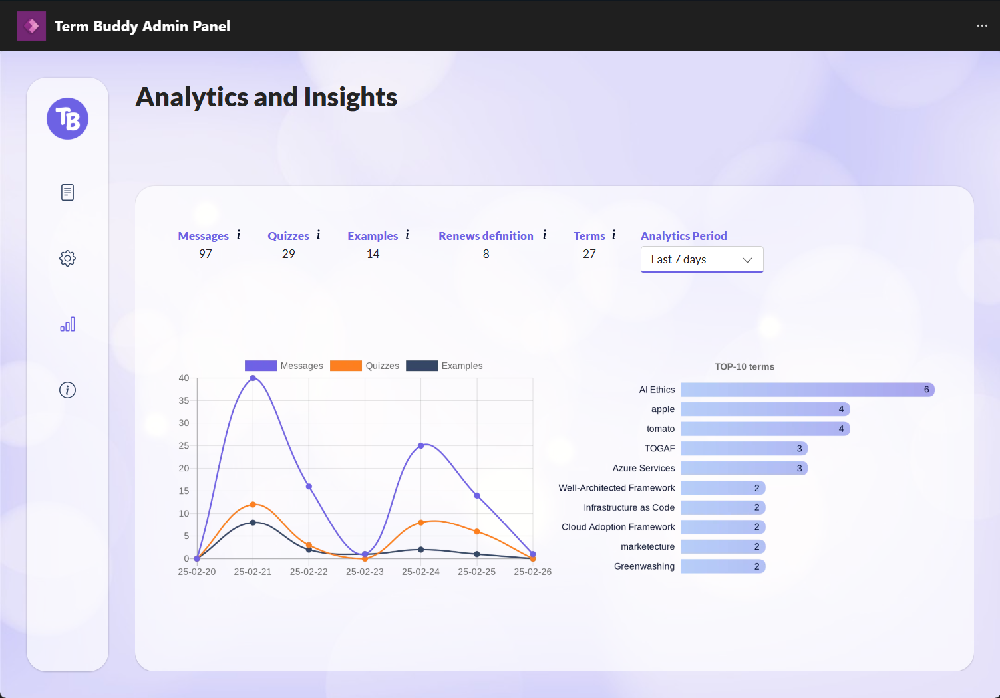
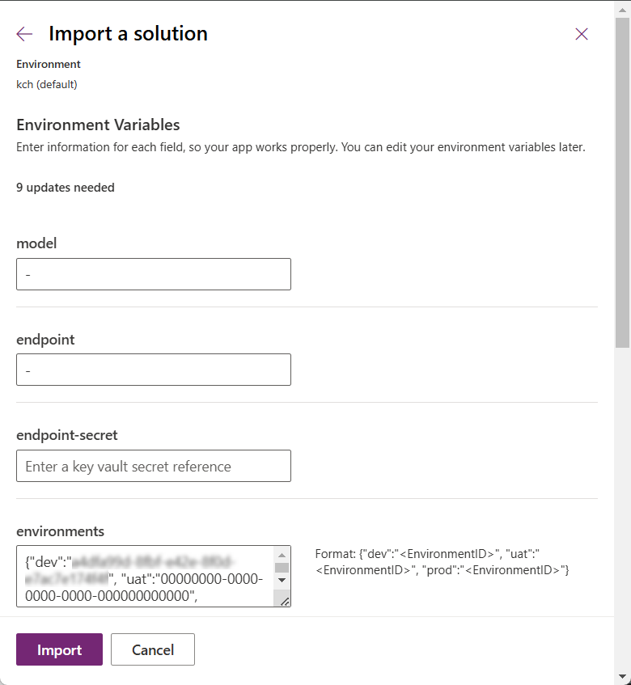

# **Term Buddy** | Hack Together 2025

## Summary

**Term Buddy** is your AI-powered terminology assistant. It provides clear term definitions, generates quizzes, and offers real-world term usage examples to enhance learning and comprehension.  

## Applies to

## Compatibility

## Contributors

* [Katerina Chernevskaya](https://github.com/Katerina-Chernevskaya)
* [Artem Chernevskiy](https://github.com/ArtemChern)

## Version history

Version|Date|Comments
-------|----|--------
1.0|February 26, 2025|Initial release

## 🚀 Features
- 🔍 **AI-Powered Definitions** – Get concise, AI-generated explanations for complex terms.  
- 🎯 **Quiz Generation** – Automatically generate quizzes to test knowledge.  
- 📚 **Real-World Usage** – Understand terms in context with practical examples.  
- 🌎 **Multi-Language Support** – Translate and explain terms in different languages.  
- 💬 **Interactive Chatbot** – Ask follow-up questions for deeper insights.  

## 📖 How It Works
1. **Search for a Term** – Enter a term, and Term Buddy provides an AI-powered definition.  
2. **Explore Context** – See real-world examples and translations.  
3. **Test Your Knowledge** – Generate a quiz to reinforce learning.  
4. **Interact with the Agent** – Ask follow-up questions for further clarification. 

## 🛠 Tech Stack

### 1️⃣ **Microsoft Teams** – User Interface & Chat Entry Point  
Serves as the primary communication channel where users interact with the **Term Buddy** Agent.  
*Provides a seamless and familiar experience for users, integrating AI-powered assistance directly into their workflow.*

### 2️⃣ **Copilot Studio (Topic-based Agent)** – User Interaction Orchestrator
Copilot Studio serves as the orchestrator, handling user queries, storing history, triggering the back-end with required parameters, and generating a well-structured adaptive card with the answer.
*Ensures seamless workflow automation, enhances user experience with dynamic responses, and enables structured, interactive AI-driven conversations while allowing for future scalability and customization.*

### 3️⃣ **Azure AI Foundry (Prompt Flow)** – AI Processing Orchestrator  
AI Foundry’s **Prompt Flow** handles request preprocessing, query structuring, and interaction with **Azure OpenAI**.  
*Ensures efficient prompt engineering, reducing hallucinations and improving response relevance by structuring AI interactions intelligently.* 

### 4️⃣ **Azure OpenAI (GPT-4o)** – AI-powered Term Definition & Explanation  
Generates accurate and contextual term explanations, real-world examples, and quizzes based on the user’s query.  
*Delivers high-quality natural language responses, enhancing learning with AI-driven explanations tailored to the user's needs.*  

### 5️⃣ **Dataverse** – Logging & Data Storage  
Stores user prompts, chat logs for auditing and insights, and dynamic data for app theming and endpoint connection, ensuring seamless adaptability and integration. 
*Facilitates in-depth auditing of past interactions, enhances AI response accuracy through data-driven improvements, and enables real-time monitoring of user engagement trends for continuous optimization.*

### 6️⃣ **Power Apps Canvas app** – Knowledge Management & Analytics  
Provides a centralized Admin Panel for the Knowledge Manager to craft and update user prompts (which are added to the master prompt), switch between default installation and customer-managed installation, add configuration parameters, and view analytics and insights.
*Empowers administrators with real-time insights, the ability to refine AI responses, configure system behavior, and manage term databases without requiring developer intervention.*

### 🔜 **Future Enhancements & Expansion Potential**  
- **Azure AI Search**: For improved term retrieval from structured and unstructured data sources.  
- **Integration with Microsoft 365**: Instant lookup within documents, emails, and Teams chats.  
- **API for External Systems**: Allowing third-party applications to integrate with Term Buddy’s AI capabilities.  

This tech stack ensures that **Term Buddy** is **scalable, intelligent, and user-friendly**, optimizing AI-powered terminology assistance for both users and knowledge managers. 🚀  

## ⚙️ Installation Options for Term Buddy

Term Buddy offers two deployment options, allowing organizations to choose the setup that best aligns with their security, cost management, and operational preferences.

### Option 1: Default Installation (Developer-Managed)

This option provides a fully managed experience where Term Buddy operates within the developer’s Azure environment, ensuring a quick and seamless setup.
- **Secure Connection:** Term Buddy connects to the developer’s Azure tenant through a secured, encrypted channel with PKI authentication, ensuring data privacy and integrity.
- **Zero Deployment Effort:** No additional setup or configuration is required from the customer.
- **Cost Management:** Azure OpenAI token costs are covered by the developer, eliminating the need for customers to manage AI consumption expenses.

*Ideal for: Organizations seeking a hassle-free deployment with minimal administrative overhead.*

### Option 2: Customer-Managed Installation

For organizations requiring full control over their infrastructure, this option enables deployment within the customer’s Azure Entra ID tenant using Bicep deployment scripts provided by the developer.
- **Azure Subscription Required:** An active Azure subscription is necessary to host Term Buddy and related services.
- **Enhanced Security:** Azure Key Vault is used to securely store and manage sensitive data, such as API keys and authentication credentials.
- **Custom Deployment:** The provided Bicep scripts automate the setup of all required Azure resources, ensuring a streamlined deployment process.

*Ideal for: Organizations prioritizing security, compliance, and direct control over their Azure resources.*

## 📝 Prerequisites

### Common Prerequisites

Regardless of the deployment option, the following prerequisites are required for accessing and using Term Buddy:
- **Power Platform Environment** – A Power Platform environment with Dataverse enabled to store user interactions and configuration settings.
- **Microsoft Teams Access** – Users must have access to Microsoft Teams to interact with the Term Buddy agent.
- **Power Apps License** – Required for accessing the Admin Panel where configurations, analytics, and knowledge management take place.
- **Copilot Studio User License** – Should be assigned assigned to individual users who need manage and publish agent. 
- **Copilot Studio Capacity** - Must be allocated within the Power Platform environment to support bot execution. Each user who needs access to create and manage agents must be assigned a Per User License (referred to as Copilot Studio User License in the Microsoft 365 admin center). Additionally, a Tenant License (referred to as Copilot Studio in the Microsoft 365 admin center) must be acquired by the tenant administrator, which is required for organization-wide usage but cannot be assigned to individual users.

### Additional Prerequisites for Option 2 (Customer-Managed Installation)

For the full control over your infrastructure, the following prerequisites are required:
- **Azure Subscription** – An active Azure subscription to host Azure AI and related services.
- **Core Azure resources** - Deployed the following Azure resources:
    - **Azure Resource Group** – Organizes all **Term Buddy**-related resources within a single logical container.
    - **Azure OpenAI** – Provides GPT-based AI capabilities for generating responses.
        - **Azure OpenAI Model (GPT-4o)** – Processes user queries and generates high-quality AI responses.
    - **Azure Key Vault** – Secures API keys and authentication credentials.
    - **Azure Blob Storage** – Stores logs from Azure AI Foundry Prompt Flow for quick retrieval and auditing.
        - **Azure Blob Storage Container** – Structured storage for categorized term data, knowledge base content, and AI-generated logs.
    - **Log Analytics Workspace** – Collects and analyzes logs from Term Buddy components to ensure monitoring and troubleshooting capabilities.
    - **Azure Application Insights** – Tracks performance and user interactions to optimize system efficiency.
    - **AI Hub** – Centralized service for managing AI Projects and related resources within the Azure environment.
    - **AI Project** – Organizes AI-related Prompt Flows, evaluation, tracing, and facilitates experimentation, testing, and deployment.

- **Prompt Flow** - Imported Prompt Flow type `chat`.

- **Endpoint** - Deployed Prompt Flow to inference Endpoint so you can utilize it via API in Term Buddy agent.

- **Key Vault Secret** - Stored Endpoint Authorization key in Azure Key Vault.

For detailed deployment instructions for this option (Customer-Managed Installation), see the [Deployment Instructions](./infra/infra-deployment.md) section.

## 🔧 Minimal path to awesome

### Using the solution zip

* [Download](./solution/termbuddy-test.zip) the `.zip` from the `solution` folder

* Within **Power Apps Studio**, import the solution `.zip` file using **Solutions** > **Import Solution** and select the `.zip` file you just packed.

* Provide value for environment variables and Import the solution.

    #|Environment Variable|Expected value|Comments
    --|--|--|--
    1|model| <li> `-` (for Option 1) <li> `model-name` (for Option 2) | The name of the model deployed at the endpoint for Prompt Flow.    *The value is used for the Option 2 (Customer-Managed Installation).*
    2|endpoint| <li> `-` (for Option 1) <li> `endpoint-uri` (for Option 2) | The URI of the endpoint for Prompt Flow.   *The value is used for the Option 2 (Customer-Managed Installation).*
    3|endpoint-secret| <li> `keep blank` (for Option 1) <li> `Path to Key Vault Secret` (for Option 2) | The path to the Azure Key Vault secret where the authentication key for accessing the primary API endpoint is securely stored.
    4|environments| `{"dev":"00000000-0000-0000-0000-000000000000", "uat":"00000000-0000-0000-0000-000000000000", "prod":"00000000-0000-0000-0000-000000000000"}` | Defines three available environments.   *Required value. Provide ID of your three environments. If you have less than three environments - keep `00000000-0000-0000-0000-000000000000` for the rest*
    5|demo-endpoint| `endpoint-uri` | The URI of the endpoint designed for demo purpose.   *Keep the value, or replace with URI of your demo endpoint.*
    6|demo-backend| <li> no (for Option 1) <li> yes (for Option 2) | The parameter used to determine whether to operate in the Developer-Managed (`no`) or Customer-Managed (`yes`) environment.
    7|demo-model| `model-name` | The model deployed at the endpoint designed for demo purpose.   *Keep the value, or replace with model name of your demo endpoint.*
    8|color-schema| `{"Primary":"#6D62E4", "Secondary":"#FC7F1E", "Regular":"#07102C", "Light":"#EDF1FA", "White":"#FFFFFF", "Accent1":"#FCC648", "Accent2":"#354765", "Accent3":"#A8A4EE", "Accent4":"#BFE2FE"}` | Defines the color theme for the UI of the Canvas app.   *Required value. Provide HEX values for all nine colors.*
    9|demo-key| `key` | The authentication key required to access the endpoint designed for demo purpose.   *Keep the value, or replace with model name of your demo endpoint.*

    

* When the solution has been imported successfully complete the following two activities:
    - **For Canvas app:** Share the `Term Buddy Admin Panel` app with target users.
    - **For Agent:** 
        - Publish `Term Buddy` agent
        - Add the agent to Teams channel
        - Share the agent with target users

* Run the application and start using Term Buddy!  

## 🎯 **Future Enhancements**  
- Integration with Microsoft 365 for instant term lookup.  
- Expansion to more specialized fields (medicine, law, engineering).  
- API for third-party integrations.  

## 💡 **Contributing**  
We welcome contributions! To contribute:  
1. Fork the repository.  
2. Create a feature branch.  
3. Submit a pull request with your changes.  

## 📜 **License**  
This project is licensed under the [MIT License](./LICENSE).  

## 🤝 **Acknowledgments**  
Built for [Hack Together 2025](https://github.com/microsoft/Powerful-Devs-Hack-Together) by **Katerina Chernevskaya** & **Artem Chernevskiy**.  

🔗 **Stay connected & contribute!**  
